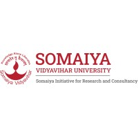
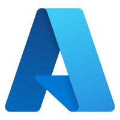

### Contact

- 📍 Vancouver, Canada  
- 📞 +1 (672) 472-6635  
- 📧 [husmail786@gmail.com](mailto:husmail786@gmail.com)  
- 🌐 [LinkedIn](https://www.linkedin.com/in/ismailbhinder) | [GitHub](https://github.com/ismailbhinder)

---

### Education

- *Master of Data Science*, The University of British Columbia (Sep 2024 – Jun 2025)
- *B.E in Computer Engineering*, K. J. Somaiya Institute of Technology (Aug 2020 – May 2024)
- *Honours in Data Science*, K. J. Somaiya Institute of Technology (Aug 2022 – May 2024)

---

### Work Experience

:::: {.columns}

::: {.column width="15%"}

:::

::: {.column width="85%"}
##### Data Science Intern  
*Heron Law Offices, Vancouver* (Apr 2025 – Jun 2025)  

- Developed a Streamlit + Plotly dashboard to visualize IRCC litigation and inadmissibility data, improving transparency in legal decisions.  
- Conducted statistical testing and EDA using R to uncover trends in immigration outcomes.  
- Built a hybrid NLP pipeline (LLaMA 3 + rule-based) to classify court metadata with 85% accuracy.  
- Collaborated with legal experts to communicate insights clearly to non-technical audiences.  
:::
::::

 

:::: {.columns}

::: {.column width="15%"}

:::

::: {.column width="85%"}
##### Research Intern  
*SIRAC – Somaiya Institute for Research and Consultancy, Mumbai* (Jan 2023 – Jul 2024)  

- Created a custom dataset of 75,000+ farm plots using OpenCV and stored it in DynamoDB.  
- Built a YOLOv8-based model (PyTorch) to extract field boundaries, digitizing 100,000+ plots.  
- Reduced mapping time and manpower by 50% using AI automation.  
- Developed a Flutter Android app enabling 92 field supervisors to map farms independently.  
- Co-authored a review paper on field-boundary extraction (under review).  
:::
::::

---

### Community Involvement

:::: {.columns}

::: {.column width="15%"}

:::

::: {.column width="85%"}
##### Mentor  
*CloudML Discovery Series — Azure Developer Community* (Jun 2024)  

Delivered sessions on AI/ML using Microsoft Azure; demonstrated real-world implementations with PyTorch, scikit-learn, and NLP libraries.
:::
::::  
---

### Skills

:::: {.columns}

::: {.column width="50%"}

##### Programming Languages  
- Python  
- R  
- SQL  
- PySpark  

##### Machine Learning & AI  
- Supervised & Unsupervised Learning  
- Deep Learning (CNNs, RNNs)  
- Feature Engineering  
- Model Optimization  
- LLM
- Fine-tuning

##### Statistics  
- Descriptive & Inferential Statistics  
- Hypothesis Testing  
- Probability Distributions  
- A/B Testing  

##### Soft Skills  
- Critical Thinking  
- Strategic Thinking  
- Adaptability  
- Presentation & Communication  
- Collaboration & Problem-Solving  

:::

::: {.column width="50%"}

##### Data Processing & Analysis  
- Data Cleaning & Wrangling  
- ETL Pipelines  
- Exploratory Data Analysis  
- Data Visualization  

##### Libraries & Frameworks  
- pandas & NumPy
- matplotlib, Altair & Plotly
- tidyverse, ggplot  
- scikit-learn & XGBoost 
- PyTorch, TensorFlow
- NetworkX 
- Dash & Streamlit 

##### Development Tools  
- Git
- Docker
- Flask
- Flutter  
- MongoDB
- AWS & Azure  
- CI/CD (GitHub Actions)
- Poetry
- pytest
- Makefile  

:::

::::
